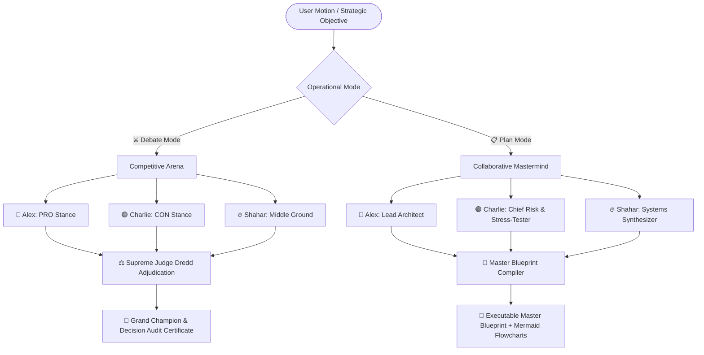

# ⚖️ DEBATE-CLUB: Dual-Mode Multi-LLM Intelligence Arena

> **The Adversarial Dialectic Arena & Collaborative Brainstorming Mastermind for High-Stakes Decisions**

[](https://www.python.org/downloads/)
[](https://opensource.org/licenses/MIT)
[](https://streamlit.io)
[](#)

---

## 🎯 The Core Philosophy: "Never Make a Critical Decision with a Single Model"

Standard single-model chatbots suffer from **sycophancy** (agreeing with user bias), **unchecked hallucinations**, and **tunnel-vision logic**. 

**Debate-Club** introduces **Multi-Model Dialectic Triangulation**: pitting foundation models (OpenAI, Anthropic Claude, Google Gemini, Grok, Groq, and local Ollama) into structured competition and collaborative co-design to produce stress-tested, fact-grounded decisions.



---

## 🌟 Dual Operational Modes

### 1. ⚔️ Debate Mode (Competitive Dialectic Arena)
- **World Universities Debating Championship (WUDC) Standards**:
  - **AREI / SEAL Argumentation**: Assertion $\rightarrow$ Causal Reasoning (Warrants) $\rightarrow$ Evidence $\rightarrow$ Impact.
  - **Championship Rebuttals**: Link Turns, "Even-If" delta refutations, mechanism breakdowns, and impact mitigations.
  - **3-Way Coalitions**: Middle-ground debaters can form tactical non-polar alliances on common premises.
- **Supreme Judge Dredd**:
  - Scores every round along **Logic & Warrants (0–10)**, **Clash & Rebuttals (0–10)**, and **Comparative Weighing (0–10)**.
  - Decrees round winners and crowns the Grand Champion with memorable verdicts.

### 2. 📋 Plan Mode (Collaborative Brainstorming Mastermind)
- **No Judge • 100% Co-Design**:
  - **Alex (Lead Architect)**: Formulates foundational vision and core system strategy.
  - **Charlie (Chief Risk & Stress-Tester / Red Team)**: Probes hidden bottlenecks, cost cliffs, and edge-case failure modes.
  - **Shahar (Systems Synthesizer)**: Unifies trade-offs into actionable milestones and KPIs.
- **Synthesized Master Blueprint**:
  - Complete Markdown document with embedded **Mermaid.js architecture flowcharts**, risk matrices, and execution roadmaps.

---

## 🚀 Key Product Capabilities

| Feature | Description |
|---|---|
| 🔑 **In-App BYOK Vault** | Enter personal OpenAI, Anthropic, Gemini, or Groq keys directly in the sidebar. Keys stay in session memory only (Zero-Data Retention). |
| 📚 **Industry Decision Templates** | 14+ battle-tested templates across Tech Architecture, GTM Strategy, Finance/CapEx, and AI Ethics. |
| 🌐 **Live Web Grounding (RAG)** | Real-time web search integration provides debaters with empirical facts and live citations. |
| 🎤 **Audience Cross-Examination** | Inject live questions or challenges between rounds to test debaters mid-session. |
| 🏛️ **Decision Audit Certificates** | Generates verifiable decision audit records with timestamps, model signatures, and exportable Markdown & HTML reports. |
| 📜 **Session History Archive** | Completed debates and blueprints auto-save to `.sessions/` for instant one-click reload. |

---

## 📦 Project Structure

```
debate-club/
├── app.py                     # Streamlit Interactive Web Application
├── cli.py                     # High-Performance Terminal CLI Runner
├── requirements.txt           # Python Dependencies
├── assets/                    # Graphic novel stage illustrations & avatar art
│   ├── arena_stage.jpg        # Formal debate courtroom stage (Debate Mode)
│   └── plan_stage.jpg         # High-tech mastermind strategy war-room (Plan Mode)
├── models/                    # Pydantic schemas & state models
│   ├── turn_response.py       # AREI, Link Turns, Warrants, and Co-design schemas
│   └── debate_state.py        # DebateState, DebaterScore, UserIntervention
├── interfaces/                # Multi-provider LLM & Search Layer
│   ├── llms.py                # Exponential backoff retries & provider clients
│   ├── model_registry.py      # Dynamic discovery & local Ollama health checks
│   └── search.py              # Live web search grounding engine (DuckDuckGo/Serper)
├── prompting/                 # Championship Prompt Engineering & Templates
│   ├── debater_prompts.py     # AREI, 4-step refutation, link turns, even-if
│   ├── judge_prompts.py       # WUDC / OIV adjudication & Judge Dredd decrees
│   ├── plan_prompts.py        # Collaborative roles & Master Blueprint compiler
│   ├── stance_generator.py    # Automated complexity & non-polar stance generator
│   └── templates.py           # 14+ curated industry strategy templates
├── debate/                    # Core Orchestration Engine
│   ├── debater.py             # Debater agent wrapper & turn execution
│   ├── judge.py               # Supreme Judge Dredd scoring & evaluations
│   ├── moderator.py           # Consensus evaluator & synthesizer
│   ├── history_manager.py     # Local session persistence (.sessions/)
│   └── engine.py              # Central engine coordinator
└── views/                     # Streamlit Presentation Components
    ├── styles.py              # Dark-mode glassmorphism & responsive CSS
    ├── stage.py               # Arena / War-Room photo with live speech balloons
    ├── scoreboard.py          # Judge Dredd chamber, leaderboard, and clash breakdown
    ├── blueprint_view.py      # Master Blueprint viewer with Mermaid diagrams & export
    ├── certificate_view.py    # Official Decision Audit Certificate & HTML generator
    ├── timeline.py            # Chronological dialogue stream
    └── control_panel.py       # Sidebar configuration & BYOK Vault
```

---

## ⚙️ Installation & Setup

1. **Clone & Setup Environment**:
   ```bash
   git clone https://github.com/Ruman87/debate-club.git
   cd debate-club
   python3 -m venv .venv
   source .venv/bin/activate
   pip install -r requirements.txt
   ```

2. **Configure API Keys (`.env`)** *(Optional — you can also use the In-App BYOK Vault or local Ollama)*:
   ```env
   OPENAI_API_KEY=your_openai_key
   ANTHROPIC_API_KEY=your_anthropic_key
   GOOGLE_API_KEY=your_gemini_key
   GROQ_API_KEY=your_groq_key
   GROK_API_KEY=your_grok_key
   ```

---

## 🖥️ Usage Guide

### 1. Launch the Interactive Web App
```bash
streamlit run app.py
```
Open **[http://localhost:8501](http://localhost:8501)** in your browser.

### 2. Run via Command Line Interface (CLI)

**Debate Mode (Competitive Arena)**:
```bash
python cli.py --app_mode debate --question "Should AI models have legal personhood rights?" --debater1 gpt-4o --debater2 claude-3-5-sonnet-latest --judge gpt-4o-mini --rounds 3
```

**Plan Mode (Brainstorming Mastermind)**:
```bash
python cli.py --app_mode plan --question "Architect a real-time multimodal search engine" --debater1 gpt-4o --debater2 gemini-2.5-flash --num_engines 2 --rounds 2 --export blueprint.md
```

---

## 🛡️ License
Distributed under the **MIT License**. See `LICENSE` for details.
